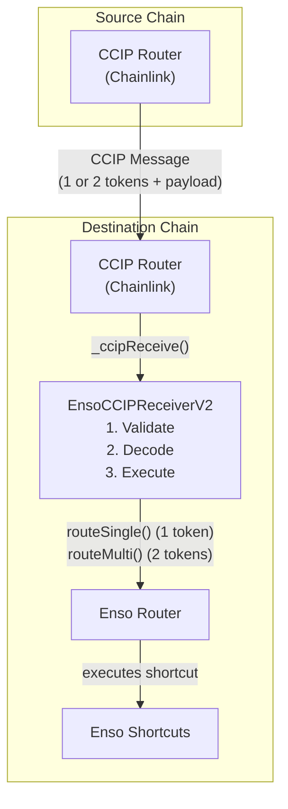
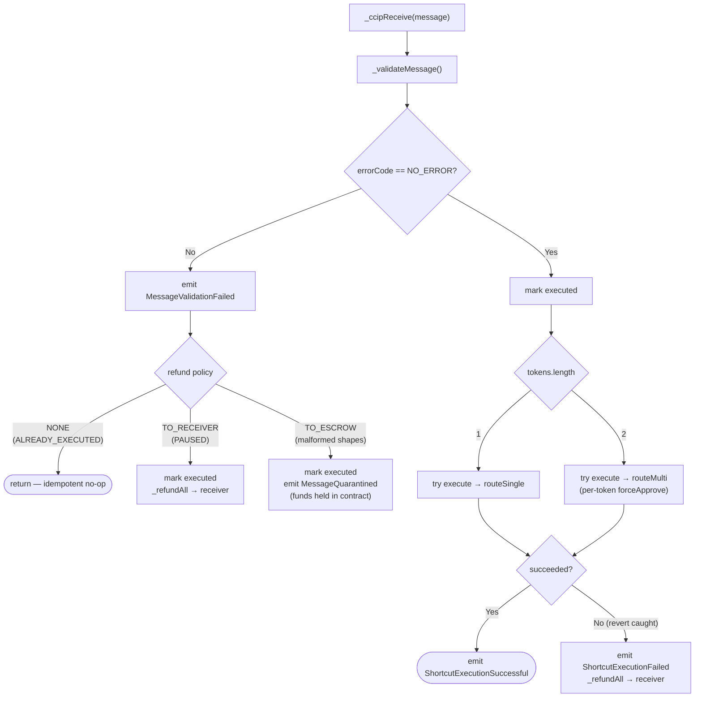
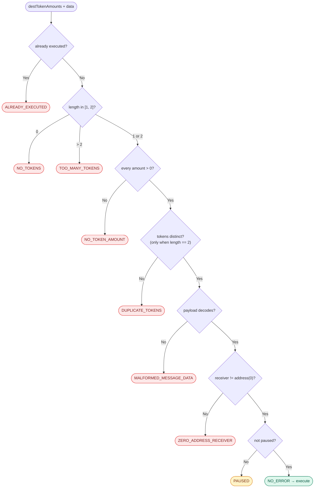

# EnsoCCIPReceiverV2

**Component:** EnsoCCIPReceiverV2 & Chainlink CCIP Integration

---

## Overview

The EnsoCCIPReceiverV2 is a destination-side contract that integrates Enso
Shortcuts with Chainlink's Cross-Chain Interoperability Protocol (CCIP). It
serves as a bridge endpoint that receives cross-chain messages carrying **one or
two** ERC-20 tokens and executes Enso Shortcuts operations on the destination
chain.

It is a drop-in successor to `EnsoCCIPReceiver` (1.0.0), which remains deployed
and unchanged. V2 keeps the same defensive design and adds support for
delivering up to `MAX_TOKENS` (2) distinct tokens in a single message.

### Purpose

Enso Shortcuts is a composable DeFi routing system that enables complex
multi-protocol operations in a single transaction. The CCIP Receiver allows
users to initiate Shortcuts operations cross-chain by:

1. Sending one or two tokens via CCIP from a source chain
2. Receiving tokens and execution data on the destination chain
3. Automatically routing tokens through Enso Shortcuts to execute complex DeFi
   operations

### Key Features

- **Multi-Token Delivery**: Accepts one or two distinct ERC-20 tokens per
  message (`routeSingle` for one, `routeMulti` for two)
- **Replay Protection**: Message ID-based idempotency to prevent duplicate
  executions
- **Defensive Error Handling**: Non-reverting error handling with
  refund/quarantine mechanisms
- **Message Validation**: Strict validation of token shape (1 or 2 distinct
  ERC-20s, each with a non-zero amount)
- **Safe Payload Decoding**: Non-reverting ABI decoding with comprehensive
  validation
- **Graceful Degradation**: Funds are safely handled even when execution fails

---

## What changed vs. V1

| Aspect               | V1 (`EnsoCCIPReceiver`)     | V2 (`EnsoCCIPReceiverV2`)                         |
| -------------------- | --------------------------- | ------------------------------------------------- |
| Tokens per message   | Exactly 1                   | 1 or 2 (`MAX_TOKENS = 2`)                         |
| `execute(...)`       | `(address, uint256, bytes)` | `(address[], uint256[], bytes)`                   |
| Router call          | `routeSingle`               | `routeSingle` (1 token) / `routeMulti` (2 tokens) |
| `MessageQuarantined` | single `token`/`amount`     | `tokens[]`/`amounts[]`                            |
| Error codes          | —                           | adds `DUPLICATE_TOKENS`                           |
| `typeAndVersion`     | `EnsoCCIPReceiver 1.0.0`    | `EnsoCCIPReceiver 2.0.0`                          |

The token set is sourced from the authoritative CCIP `destTokenAmounts` (tokens
and amounts are paired, so always equal length). The payload format is
unchanged: `abi.encode(address receiver, bytes shortcutData)`.

---

## Architecture

### High-Level Architecture



### Contract Inheritance

The contract inherits from:

- **CCIPReceiver**: Provides router gating and base CCIP functionality
- **Ownable2Step**: Two-step ownership transfer for security
- **Pausable**: Emergency pause mechanism
- **ITypeAndVersion**: Contract versioning

### Key State Variables

- `MAX_TOKENS` (constant): Maximum distinct tokens accepted per message (2)
- `i_ensoRouter` (immutable): Enso Router address for executing Shortcuts
- `s_executedMessage` (mapping): Replay protection tracking

### Core Functions

- `_ccipReceive()`: Main entry point called by CCIP Router
- `execute()`: Self-callable function that routes one or two tokens to the Enso
  Router (`routeSingle` / `routeMulti`)
- `pause()`/`unpause()`: Emergency controls
- `recoverTokens()`: Owner-only token recovery for quarantined funds (per token)

---

## Message Payload Format

### Expected Format

```solidity
abi.encode(
    address receiver,        // Destination for refunds
    bytes shortcutData       // Enso Shortcuts execution data
)
```

The delivered tokens themselves are taken from the CCIP message's
`destTokenAmounts`, not from this payload.

### Decoding

Handled by `CCIPMessageDecoder._tryDecodeMessageData()` (shared with V1).

### Validation Checks

- Minimum 96 bytes (address + offset + length word)
- Word-aligned offsets
- Bounds checking
- Length validation

---

## Error Codes & Refund Policies

### Error Codes

Values `0–7` are identical to V1 (`EnsoCCIPReceiver`) so existing
decoders/indexers keep interpreting the same `uint8` consistently;
`DUPLICATE_TOKENS` is appended as value `8` (the only V2 addition).

| #   | Error Code               | Description                                          |
| --- | ------------------------ | ---------------------------------------------------- |
| 0   | `NO_ERROR`               | Message is valid and ready for execution             |
| 1   | `ALREADY_EXECUTED`       | Message ID was previously processed (idempotent)     |
| 2   | `NO_TOKENS`              | No tokens delivered                                  |
| 3   | `TOO_MANY_TOKENS`        | More than `MAX_TOKENS` (2) tokens delivered          |
| 4   | `NO_TOKEN_AMOUNT`        | A delivered token amount is zero (`errorData`=index) |
| 5   | `MALFORMED_MESSAGE_DATA` | Payload cannot be decoded                            |
| 6   | `ZERO_ADDRESS_RECEIVER`  | Decoded receiver is zero address                     |
| 7   | `PAUSED`                 | Contract is paused                                   |
| 8   | `DUPLICATE_TOKENS`       | A two-token delivery contained the same token twice  |

### Refund Policies

| Policy        | Description                                       |
| ------------- | ------------------------------------------------- |
| `NONE`        | No action (for idempotent no-ops)                 |
| `TO_RECEIVER` | Refund every delivered token to decoded receiver  |
| `TO_ESCROW`   | Quarantine funds in contract (malformed messages) |

### Error Code → Refund Policy Mapping

| Error Code               | Refund Policy | Action                        |
| ------------------------ | ------------- | ----------------------------- |
| `NO_ERROR`               | NONE          | Execute Shortcut              |
| `ALREADY_EXECUTED`       | NONE          | Idempotent no-op              |
| `PAUSED`                 | TO_RECEIVER   | Refund all tokens to receiver |
| `NO_TOKENS`              | TO_ESCROW     | Quarantine                    |
| `TOO_MANY_TOKENS`        | TO_ESCROW     | Quarantine                    |
| `NO_TOKEN_AMOUNT`        | TO_ESCROW     | Quarantine                    |
| `MALFORMED_MESSAGE_DATA` | TO_ESCROW     | Quarantine                    |
| `ZERO_ADDRESS_RECEIVER`  | TO_ESCROW     | Quarantine                    |
| `DUPLICATE_TOKENS`       | TO_ESCROW     | Quarantine                    |

---

## Message Processing Flow



### Validation Sequence

`_validateMessage` applies these checks in order; the first failure wins and
determines the `ErrorCode`.



1. **Replay Protection** → Check `s_executedMessage[messageId]`
2. **Token Shape Validation** → `destTokenAmounts.length` in `{1, 2}`
3. **Per-Token Amount** → every delivered amount must be non-zero
4. **Distinct Tokens** → for two tokens, `tokens[0] != tokens[1]`
5. **Payload Decoding** → Decode `(address, bytes)` from `data`
6. **Receiver Validation** → Check decoded receiver address
7. **Environment Check** → Check pause status

On the happy path, one token is routed via `EnsoRouter.routeSingle` and two via
`EnsoRouter.routeMulti` (with a per-token `forceApprove`). Execution runs
through a `try this.execute(...)` self-call; on revert, all delivered tokens are
refunded to the decoded receiver.

---

## Roles & Permissions

Identical to V1: the **Owner** can pause/unpause, recover tokens, and transfer
or renounce ownership (two-step); the **CCIP Router** is the only caller allowed
into `_ccipReceive()`; the contract calls `execute()` on **itself** only;
**view** functions (`getEnsoRouter()`, `wasMessageExecuted()`,
`typeAndVersion()`) are public.

---

## Invariants

1. **Replay Protection**: Once a message ID is marked as executed, it can never
   be processed again
2. **No Token Loss**: Every delivered token is either successfully routed,
   refunded to receiver, or quarantined (recoverable by owner)
3. **Immutable Router**: `i_ensoRouter` address cannot change after deployment
4. **Non-Reverting**: `_ccipReceive()` must never revert; all errors are handled
   gracefully (including duplicate tokens and length/amount issues)
5. **Idempotency**: Processing the same messageId multiple times has the same
   effect as processing it once
6. **Bounded Tokens**: At most `MAX_TOKENS` distinct tokens are ever routed in a
   single message

---

## Dependencies

- **Chainlink CCIP**: `chainlink-ccip` package (v1.6.2) - CCIPReceiver base
  contract
- **OpenZeppelin Contracts**: Access control (Ownable2Step), Pausable, SafeERC20
- **Enso Router**: Interface only - execution engine for Shortcuts

---

## Testing

### Test Location

`test/unit/concrete/bridge/ensoCCIPReceiverV2/`

### Running Tests

```bash
# Run specific test files
forge test --match-path 'test/unit/concrete/bridge/ensoCCIPReceiverV2/*.t.sol'

# Run with verbose output
forge test -vvv
```

---

## Known Limitations

1. **Up to Two Tokens**: At most two distinct ERC-20 tokens per message
2. **No Native ETH**: Only ERC-20 tokens are supported
3. **Distinct Tokens Only**: A two-token message must carry two different tokens
4. **Manual Recovery**: Quarantined funds require owner intervention
5. **Gas Limits**: Gas estimation must be handled off-chain when constructing
   messages
